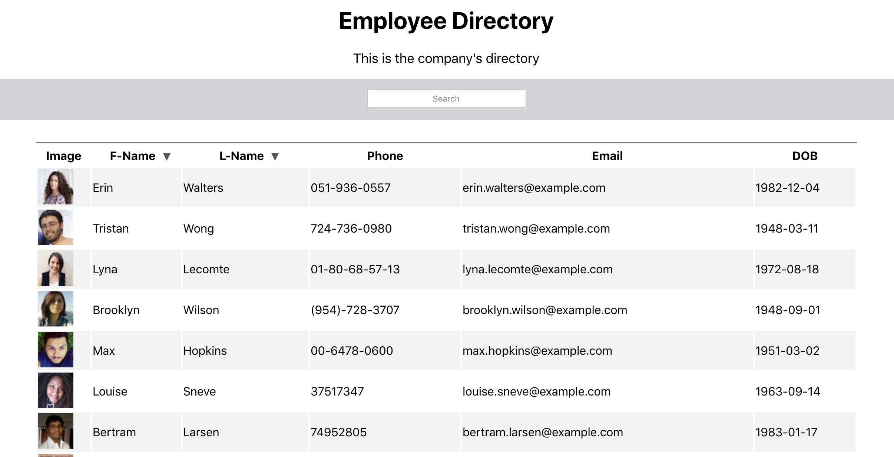

## About employee-dir 

An application allows employer to view and have quick access to the entire employee directory.

## Demonstration:

## Installation: 
- Install `create-react-app`
- Run `npm install`
- Run `node.js`
- Run `npm install gh-pages --save-dev`
- Run `npm deploy`
- Run `npm start`

## Description:

For this assignment, I have to create an employee directory with React. It also requires to break up the application's UI into components, manage component state, and respond to user events.

## Lisence:

ReactJS

## Create a React file structure: 

- Install package.json
- Create components in which it has an JSX file and a CSS file
- Creat an API.js file which connet to the API: `https://randomuser.me/api/?results=50`

## Link to employee-dir on GitHub:

https://github.com/iamha1/employee-dir

## Link for GitHub Deployement: 

hhttps://iamha1.github.io/employee-dir

